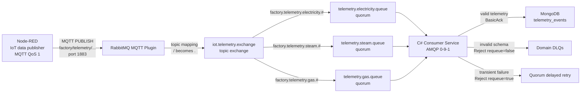
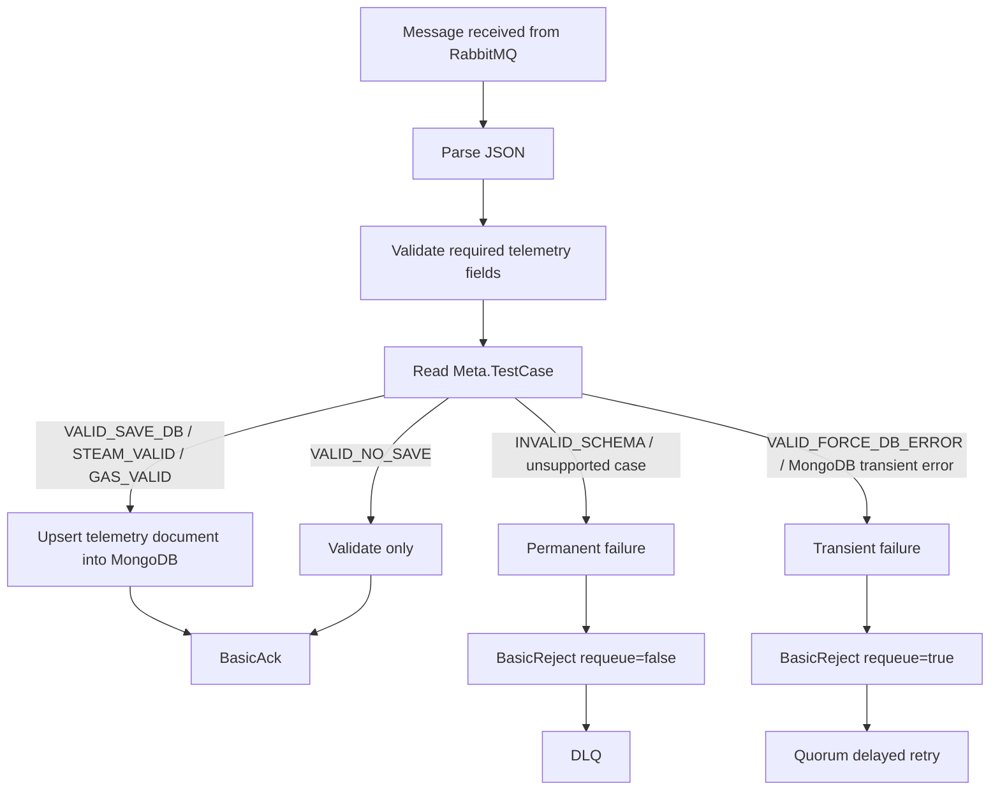

# IoT Telemetry Pipeline Deliverables Wiki

## 1. Scope

This document describes the primary project deliverable: a QoS 1 MQTT telemetry pipeline backed by RabbitMQ quorum queues and a standalone C# consumer service.

## 2. What The System Does

Node-RED simulates IoT devices and publishes telemetry messages to RabbitMQ using MQTT QoS 1.

RabbitMQ receives MQTT messages through the MQTT plugin, maps MQTT topics to AMQP routing keys, and routes them through a custom topic exchange:

```
iot.telemetry.exchange
```

The exchange routes messages into durable quorum queues:

```
telemetry.electricity.queue
telemetry.steam.queue
telemetry.gas.queue
```

A standalone C# consumer service subscribes to those queues, validates incoming telemetry, persists valid data to MongoDB, and rejects invalid messages into DLQs.

## 3. Runtime Components

| Component | Responsibility | Local Access |
| --- | --- | --- |
| Node-RED | Simulates IoT publishers and sends MQTT QoS 1 telemetry | [http://localhost:18080](http://localhost:18080) |
| RabbitMQ 4.3 cluster | MQTT listener, custom exchange, quorum queues, DLQ topology | [http://localhost:15672](http://localhost:15672) |
| MongoDB | Stores valid telemetry documents | [localhost:27017](http://localhost:27017) |
| C# Consumer Service | Consumes RabbitMQ domain queues and applies processing rules | Docker service: `consumer-service` |

RabbitMQ runs as a three-node local cluster:

| Node | AMQP | Management UI | MQTT |
| --- | --- | --- | --- |
| `rabbitmq-1` | `5672` | `15672` | `18883` |
| `rabbitmq-2` | `5673` | `15673` | `18884` |
| `rabbitmq-3` | `5674` | `15674` | `18885` |


## 4. Primary Architecture



## 5. RabbitMQ Topology

The project uses a custom topic exchange instead of using `amq.topic` as the final business exchange:

```
iot.telemetry.exchange
```

This makes the application routing topology explicit and separates business routing from RabbitMQ's built-in exchanges.

### Processing Queues

| Queue | Type | Purpose |
| --- | --- | --- |
| `telemetry.electricity.queue` | quorum | Processes electricity telemetry |
| `telemetry.steam.queue` | quorum | Processes steam telemetry |
| `telemetry.gas.queue` | quorum | Processes gas telemetry |

These queues are durable quorum queues. They are the main processing queues consumed by the C# service.

### Dead-Letter Queues

| Queue | Type | Purpose |
| --- | --- | --- |
| `telemetry.electricity.dlq` | quorum | Stores failed electricity messages |
| `telemetry.steam.dlq` | quorum | Stores failed steam messages |
| `telemetry.gas.dlq` | quorum | Stores failed gas messages |

### Queue Arguments

Domain queues use quorum and delayed retry settings:

```
x-queue-type = quorum
x-quorum-initial-group-size = 3
x-quorum-target-group-size = 3
x-delivery-limit = 5
x-delayed-retry-type = all
x-delayed-retry-min = 1000
x-delayed-retry-max = 30000
```


## 6. Quorum Replica And Leader Promotion

Quorum queues have one leader and replicated followers. In RabbitMQ UI, `rabbit@rabbitmq-2 +2` means the queue leader is on `rabbitmq-2` and two other nodes hold replicas. If the leader container stops and a majority is still available, RabbitMQ promotes another replica.

Before stop node rabbitmq-3:


After stop node rabbitmq-3:


## 7. MQTT Topic Routing

Node-RED publishes slash-style MQTT topics. RabbitMQ MQTT plugin maps slash-separated MQTT topics into dot-separated AMQP routing keys.

| Node-RED MQTT Topic | RabbitMQ Routing Key | Target Queue |
| --- | --- | --- |
| `factory/telemetry/electricity/valid` | `factory.telemetry.electricity.valid` | `telemetry.electricity.queue` |
| `factory/telemetry/electricity/invalid` | `factory.telemetry.electricity.invalid` | `telemetry.electricity.queue` |
| `factory/telemetry/electricity/no-save` | `factory.telemetry.electricity.no-save` | `telemetry.electricity.queue` |
| `factory/telemetry/electricity/db-error` | `factory.telemetry.electricity.db-error` | `telemetry.electricity.queue` |
| `factory/telemetry/steam/valid` | `factory.telemetry.steam.valid` | `telemetry.steam.queue` |
| `factory/telemetry/gas/valid` | `factory.telemetry.gas.valid` | `telemetry.gas.queue` |

RabbitMQ bindings:

```
factory.telemetry.electricity.# -> telemetry.electricity.queue
factory.telemetry.steam.#       -> telemetry.steam.queue
factory.telemetry.gas.#         -> telemetry.gas.queue
```

This proves that different telemetry domains are routed through the same custom exchange into their designated domain queues.


## 8. Data Publisher Simulation

The Node-RED flow is stored at:

```
simulators/node-red-publisher/flows.json
```

The MQTT output node is configured with QoS 1. This means the MQTT protocol uses PUBACK for at-least-once delivery between Node-RED and RabbitMQ. Node-RED does not need custom code to manually process PUBACK; the MQTT client implementation handles that protocol behavior.

Manual inject test cases:

| Inject Node | Test Case | Expected Result |
| --- | --- | --- |
| Electricity Valid | `VALID_SAVE_DB` | Routed to electricity queue, saved to MongoDB, ACKed |
| Electricity Invalid | `INVALID_SCHEMA` | Routed to electricity queue, rejected into DLQ |
| Electricity No Save | `VALID_NO_SAVE` | Routed to electricity queue, validated, ACKed without MongoDB write |
| Electricity DB Error | `VALID_FORCE_DB_ERROR` | Routed to electricity queue, transient retry path |
| Steam Valid | `STEAM_VALID` | Routed to steam queue, saved to MongoDB, ACKed |
| Gas Valid | `GAS_VALID` | Routed to gas queue, saved to MongoDB, ACKed |


## 9. Consumer Application

The consumer is a standalone C# service located at:

```
apps/consumer-service
```

It connects to RabbitMQ over AMQP 0-9-1 and subscribes to three domain queues:

```
telemetry.electricity.queue
telemetry.steam.queue
telemetry.gas.queue
```

The consumer uses one connection and separate channels for the subscribed queues.



Expected consumer logs:

```
Persisted telemetry message <MessageId> from queue telemetry.electricity.queue
Rejecting permanent failure from queue telemetry.electricity.queue
Rejecting transient failure from queue telemetry.electricity.queue; requeue=true
```


## 10. MongoDB Persistence

Valid telemetry messages are saved into MongoDB:

```
database: iot_telemetry
collection: telemetry_events
```

The consumer upserts by `MessageId`, which makes repeated delivery safer for demonstration because duplicated QoS 1 messages do not create duplicate documents with the same message identity.


## 11. Security And Production-Style Choices

| Area | Implementation |
| --- | --- |
| MQTT authentication | Anonymous MQTT access is disabled |
| RabbitMQ users | Separate users for admin, publisher, and consumer |
| RabbitMQ topology | Definitions are rendered and imported from source-controlled templates |
| RabbitMQ passwords | Password hashes are generated with `rabbitmqctl hash_password` |
| Node-RED credentials | `flows_cred.json` is generated at startup and not committed |
| MongoDB authentication | MongoDB root and app users are configured through env and init script |
| Queue durability | Processing queues and DLQs are quorum queues |
| Permissions | Publisher can write telemetry topics; consumer can read only domain queues |


## 12. Runbook

Start the stack:

```bash
docker compose up -d
```

Open UIs:

```
Node-RED: http://localhost:1880
RabbitMQ: http://localhost:15672
```

Check queues:

```bash
docker compose exec rabbitmq-1 rabbitmqctl list_queues -p iot name type consumers messages state
```

Check AMQP connections:

```bash
docker compose exec rabbitmq-1 rabbitmqctl list_connections name protocol user vhost channels state
```

Watch consumer logs:

```bash
docker compose logs -f consumer-service
```

Watch Node-RED logs:

```bash
docker compose logs -f node-red
```

## 13. Optional Extension: QoS 0 Clean-Session Device

QoS 0 is not the main task requirement in this document. It is an optional design extension for a different use case: lightweight command delivery to online MQTT devices.

In that model:

```
AMQP or MQTT publisher -> iot.telemetry.exchange -> MQTT QoS 0 subscriber
```

RabbitMQ can create a runtime MQTT QoS 0 subscription queue for a clean-session MQTT subscriber:

```
mqtt-subscription-<client-id>qos0
```

This queue is not a backend processing queue and should not be used by the C# AMQP consumer. If an AMQP consumer also needs the same command stream, it should use a separate classic or quorum queue bound to the same routing key.

Comparison:

| Path | Main Consumer | Queue Type | Use Case |
| --- | --- | --- | --- |
| QoS 1 telemetry processing | C# AMQP consumer | quorum | Reliable telemetry processing, retry, DLQ, MongoDB persistence |
| QoS 0 clean-session device | MQTT subscriber | MQTT QoS 0 queue | Lightweight command delivery to online devices |

## 14. Design Decisions

### Custom Topic Exchange

The system uses `iot.telemetry.exchange` instead of using `amq.topic` directly. This makes the exchange part of the application contract and keeps routing rules explicit.

### Domain Queues

Electricity, steam, and gas have separate queues. This makes the routing proof clear and allows future scaling or failure isolation per telemetry domain.

### Quorum Queues

Quorum queues are used for processing queues because telemetry data should survive node failures and support delayed retry/DLQ behavior.

### QoS 0 As An Extension

QoS 0 is documented separately because it solves a different problem. It is good for online device command delivery, not for durable telemetry processing.